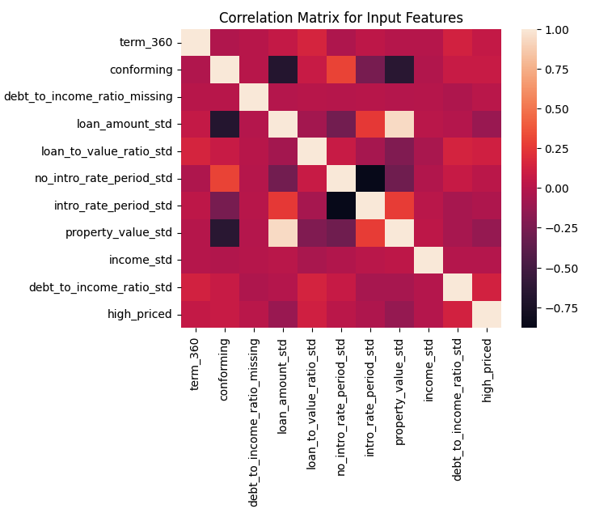

### License

Copyright (c) 2021 - 2025 Patrick Hall (jphall@gwu.edu), Hanna Courtot (Hanna.Courtot@gwu.edu), Elias Makanganise (eliasm@gwu.edu), Jabari Rose (Jabari.rose@gwmail.gwu.edu) and Pratyush Singhal (pratyush.singhal@gwu.edu)

Licensed under the Apache License, Version 2.0 (the "License"); you may not use this file except in compliance with the License. You may obtain a copy of the License at

http://www.apache.org/licenses/LICENSE-2.0

Unless required by applicable law or agreed to in writing, software distributed under the License is distributed on an "AS IS" BASIS, WITHOUT WARRANTIES OR CONDITIONS OF ANY KIND, either express or implied. See the License for the specific language governing permissions and limitations under the License.

DISCLAIMER: This notebook is not legal or compliance advice.


# Credit Line Increase Model Card

### Basic Information

* **Person or organization developing model**: Patrick Hall (jphall@gwu.edu), Hanna Courtot (Hanna.Courtot@gwu.edu), Elias Makanganise (eliasm@gwu.edu), Jabari Rose (Jabari.rose@gwmail.gwu.edu) and Pratyush Singhal (pratyush.singhal@gwu.edu)
* **Model creation date**: August, 2021
* **Model modification date**: April, 2025
* **Model version**: 1.0
* **License**: MIT
* **Model implementation code**: [DNSC_6301_Example_Project.ipynb](https://github.com/jphall663/GWU_DNSC_6301_project/blob/main/DNSC_6301_Example_Project.ipynb)

### Intended Use - DONE
 
- **Describe the business value of your group’s best remediated model**: This model is not intended to generate any value for commercial/business purposes.
- **Describe how your group’s best remediated model is designed to be used**: This model is designed solely for educational purposes.
- **Describe the intended users for your group’s best remediated model**: This model is designed for students and individuals interested in learning about bias in machine learning models.
- **State whether your group’s best remediated model can or cannot be used for any additional purposes**: Our model cannot be used for any additional purposes. Any use beyond an educational example is out-of-scope.

### Training Data - STARTED

- **State the source of training data**: [GW DNSC 6330 Class Github Training Data Zip](https://github.com/jphall663/GWU_rml/tree/master/assignments/data), email `jphall@gwu.edu` for more information
- **State how training data was divided into training and validation data**: 70% training and 30% validation
- **State the number of rows in training and validation data**: 112253 training rows and 48085 validation rows
- **Define the meaning of all training data columns**: 
- **Define the meaning of all engineered columns**: 


NOTE: UPDATE WITH Data dictionary is in assignment 1 

* Data dictionary:

| Name | Modeling Role | Measurement Level| Description|
| ---- | ------------- | ---------------- | ---------- |
|**ID**| ID | int | unique row indentifier |
| **LIMIT_BAL** | input | float | amount of previously awarded credit |
| **SEX** | demographic information | int | 1 = male; 2 = female
| **RACE** | demographic information | int | 1 = hispanic; 2 = black; 3 = white; 4 = asian |
| **EDUCATION** | demographic information | int | 1 = graduate school; 2 = university; 3 = high school; 4 = others |
| **MARRIAGE** | demographic information | int | 1 = married; 2 = single; 3 = others |
| **AGE** | demographic information | int | age in years |
| **PAY_0, PAY_2 - PAY_6** | inputs | int | history of past payment; PAY_0 = the repayment status in September, 2005; PAY_2 = the repayment status in August, 2005; ...; PAY_6 = the repayment status in April, 2005. The measurement scale for the repayment status is: -1 = pay duly; 1 = payment delay for one month; 2 = payment delay for two months; ...; 8 = payment delay for eight months; 9 = payment delay for nine months and above |
| **BILL_AMT1 - BILL_AMT6** | inputs | float | amount of bill statement; BILL_AMNT1 = amount of bill statement in September, 2005; BILL_AMT2 = amount of bill statement in August, 2005; ...; BILL_AMT6 = amount of bill statement in April, 2005 |
| **PAY_AMT1 - PAY_AMT6** | inputs | float | amount of previous payment; PAY_AMT1 = amount paid in September, 2005; PAY_AMT2 = amount paid in August, 2005; ...; PAY_AMT6 = amount paid in April, 2005 |
| **DELINQ_NEXT**| target | int | whether a customer's next payment is delinquent (late), 1 = late; 0 = on-time |


### Evaluation Data - DONE

- **State the source of evaluation (or “test”) data**: [GW DNSC 6330 Class Github Test Data Zip](https://github.com/jphall663/GWU_rml/tree/master/assignments/data), email `jphall@gwu.edu` for more information
- **State the number of rows in evaluation (or “test”) data**: 19831 rows
- **State any differences in columns between training and evaluation (or “test”) data**: The test data does not contain the y-column/target variable 'high_priced'.

### Model Details - DONE

- **State the columns used as inputs in your group’s best remediated model**: 'debt_to_income_ratio_missing', 'conforming', 'term_360', 'intro_rate_period_std', 'debt_to_income_ratio_std', 'income_std', 'loan_amount_std', 'no_intro_rate_period_std'
- **State the columns used as targets in your group’s best remediated model**: 'high_priced'
- **State the type of your group’s best remediated model**: Explainable Boosting Machine (EBM)
- **State the software used to implement your group’s best remediated model**: Python, Interpret
- **State the version of the modeling software for your group’s best remediated model**: 3.11.12, 0.6.10
- **State the hyperparameters or other settings of your group’s best remediated model**:

```
rem_params = {'max_bins': 512, 'max_interaction_bins': 64, 'interactions': 10,
              'outer_bags': 8, 'inner_bags': 4, 'learning_rate': 0.05,
              'validation_size': 0.25, 'min_samples_leaf': 5, 'max_leaves': 3,
              'n_jobs': 4, 'early_stopping_rounds': 100, 'random_state': 12345}
```

### Quantitative Analysis - STARTED

NOTE: You should briefly address your other models as “alternative approaches” in the Quantitative analysis section, and point to why your main model is a better choice.

- **State the metrics used to evaluate your group’s best remediated model**: Area Under the Curve (AUC) and Adverse Impact Ratio (AIR)
- **State the values of the metrics for training, validation, and evaluation (or “test”) data – evaluation (or “test”) metrics come from the most recent class full evaluation results, link under Assignment 1.**: 

NOTE: Use Validation and test AUC from bottom assignment 5!
NOTE: Take average of all 5 AUC from assignment 5!


| Train AUC | Validation AUC | Test AUC |
| ------ | ------- | -------- |
| 0.7494 | 0.7891  | 0.7687* |

Table 1. AUC values across data partitions. 

| Group | Validation AIR |
|-------|-----|
| Black vs. White | 0.8345 |
| Hispanic vs. White | 0.8765 |
| Asian vs. White | 1.098 |
| Female vs. Male | 1.245 |

Table 2. Validation AIR values for race and sex groups. 

- **Provide at least one plot or table from each weekly assignment for a total of at least six plots, that must include the global variable importance and partial dependence of your group’s best remediated model.**: 
- **Address other alternative models considered**: We tried using the general linear model (GLM) with elastic net, monotonic gradient boosting machines (GBM), extreme gadient boosting (XGBoost) and explainable boosting machine (EBM). The models tried can be found in [assigment 1](https://github.com/HannaCourtot/DNSC-6330---Responsible-Machine-Learning/blob/main/Group_5_assign_1.ipynb).

(**HINT**: Test AUC taken from https://github.com/jphall663/GWU_rml/blob/master/assignments/model_eval_2023_06_21_12_52_47.csv)

NOTE: Add something other than a heat map, use something more interesting!

#### Correlation Heatmap - DONE



Figure 1. Correlation matrix for input features. 

### Ethical Considerations

NOTE: only place you write a short paragraph about bias, performance can drop during a recession

* **Describe potential negative impacts of using your group’s best remediated model:**
  - Consider math or software problems
  - Consider real-world risks: who, what, when and how?

* **Describe potential uncertainties relating to the impacts of using your group’s best remediated model:**
  - Consider math or software problems
  - Consider real-world risks: who, what, when and how?

* **Describe any unexpected or results encountered during training**

